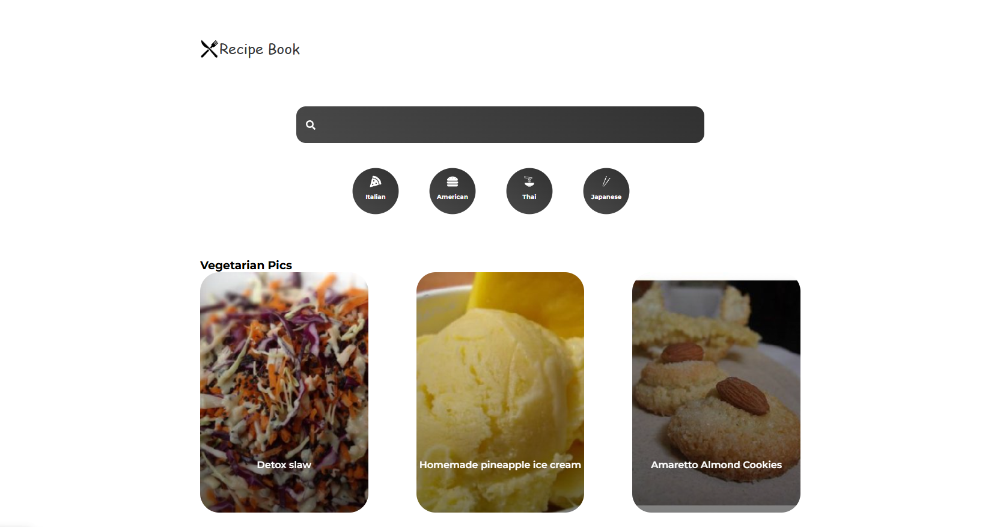

# Recipe Book App

A modern React application for browsing and discovering recipes from different cuisines.



## Features

- Browse popular recipes
- View vegetarian recipes
- Filter recipes by cuisine (Italian, American, Thai, Japanese)
- Search for specific recipes
- View detailed recipe information including:
  - Instructions
  - Ingredients
  - Summary

## Tech Stack

- [React](https://reactjs.org/)
- [React Router](https://reactrouter.com/) for navigation
- [Styled Components](https://styled-components.com/) for styling
- [Framer Motion](https://www.framer.com/motion/) for animations
- [Spoonacular API](https://spoonacular.com/food-api) for recipe data
- [React Splide](https://splidejs.com/integration/react-splide/) for carousels

## Project Structure

```
src/
├── Components/
│   ├── Category.jsx - Cuisine category navigation
│   ├── Popular.jsx - Popular recipes carousel
│   ├── Search.jsx - Search functionality
│   └── Veggie.jsx - Vegetarian recipes carousel
├── Pages/
│   ├── Cuisine.jsx - Cuisine-specific recipe listings
│   ├── Home.jsx - Homepage with carousels
│   ├── Pages.jsx - Main routing component
│   ├── Recipe.jsx - Detailed recipe view
│   └── Searched.jsx - Search results page
├── App.js - Main application component
├── index.js - Application entry point
└── index.css - Global styles
```

## Installation and Setup

1. Clone the repository:
   ```
   git clone https://github.com/yourusername/recipe-book.git
   cd recipe-book
   ```

2. Install dependencies:
   ```
   npm install
   ```

3. Create a `.env` file in the root directory with your Spoonacular API key:
   ```
   REACT_APP_API_KEY=your_spoonacular_api_key
   ```

4. Start the development server:
   ```
   npm start
   ```

5. Open [http://localhost:3000](http://localhost:3000) to view the app in your browser.

## API Integration

This application uses the [Spoonacular API](https://spoonacular.com/food-api) to fetch recipe data. To use this application, you'll need to:

1. Register for a free account at [Spoonacular](https://spoonacular.com/food-api/console#Dashboard)
2. Get your API key from the dashboard
3. Add it to your `.env` file as described in the setup instructions

## Local Storage

The app uses local storage to cache recipe data and reduce API calls, improving performance and avoiding unnecessary API usage.

## Design Features

- Responsive design with grid layouts
- Modern UI with smooth transitions and animations
- Category selection with visual feedback
- Recipe cards with gradient overlays for better text readability
- Tabbed interface for recipe details

## Future Enhancements

- User authentication
- Save favorite recipes
- Create meal plans
- Add dietary restriction filters
- Recipe ratings and reviews

## Contributing

1. Fork the repository
2. Create your feature branch (`git checkout -b feature/amazing-feature`)
3. Commit your changes (`git commit -m 'Add some amazing feature'`)
4. Push to the branch (`git push origin feature/amazing-feature`)
5. Open a Pull Request

## License

This project is licensed under the MIT License - see the LICENSE file for details.

## Acknowledgments

- Spoonacular API for providing recipe data
- React and its ecosystem for making UI development enjoyable